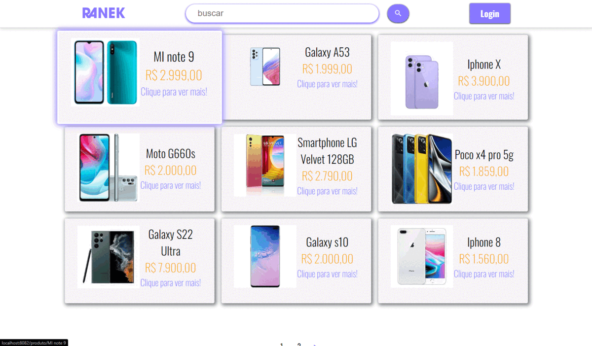

# Ranek
Este site foi criado para treinar tudo o que foi aprendido em um curso de Vue 2.
A ideia é de um e-comerce de eletrônicos.

Como no momento sou apenas Front-end a API que foi utilizada é uma biblioteca chamada Json server que já possui vários metodos de uma API REST real.

Neste site é possível:
+ Buscar produtos pelo nome
+ Criar um usuário
+ Logar usuário
+ Editar dados do usuário
+ Comprar produtos
+ Adicionar produtos
+ Excluir produtos

## Neste projeto foi utilizada as seguintes bibliotecas:
+ Vuex
+ Vue Router
+ Axios
+ Json-Server

## para instalar a dependencia: 
```
npm install
```

## Após instaladas todas as dependências abra dois terminais:
No primeiro terminal você vai dar o seguinte comando:
```
cd app
```
```
npm run serve
```
No segundo terminal:
```
cd api
```
```
json-server --watch ranek.json
```

